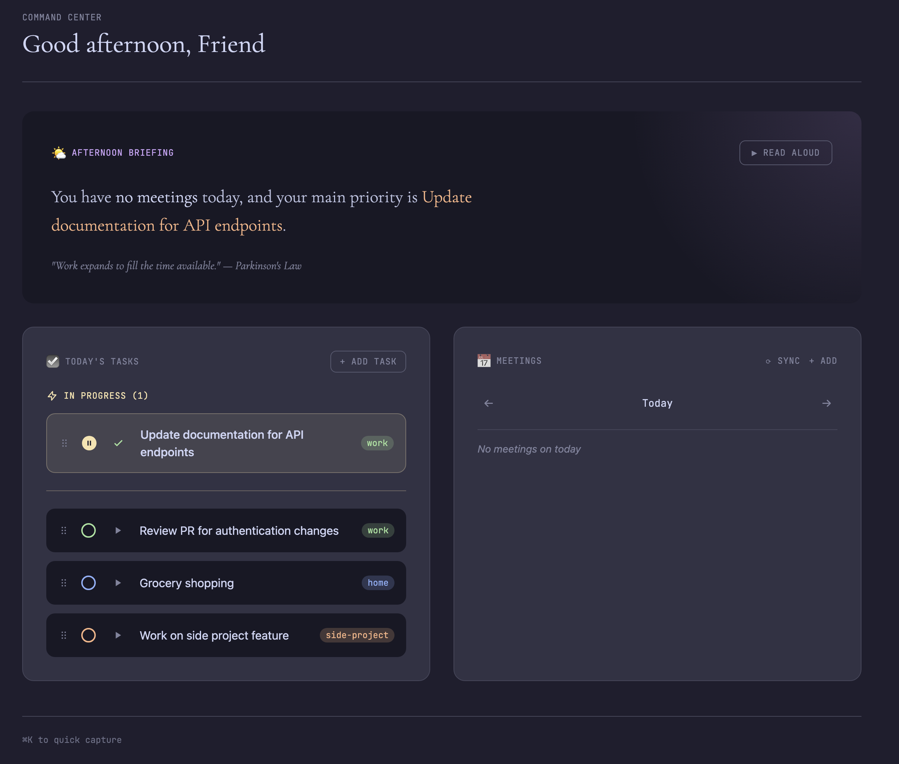

# Command Center Lite

A lightweight personal dashboard for your day. Shows your morning briefing, tasks, and meetings in one place.

Built with Electron, React, TypeScript, and Vite.



## Features

- **Morning Briefing** - Get a personalized greeting and overview of your day
- **Tasks** - Local task management with priority levels
- **Meetings** - View your calendar from Microsoft 365 via WorkIQ

## Getting Started

### Prerequisites

- [Node.js](https://nodejs.org/) (v18 or higher)
- [GitHub Copilot CLI](https://docs.github.com/en/copilot/using-github-copilot/using-github-copilot-in-the-command-line) (for WorkIQ setup)
- A Microsoft 365 account (for calendar sync)

### 1. Clone and Install

```bash
git clone https://github.com/YOUR_USERNAME/command-center-lite.git
cd command-center-lite
npm install
```

### 2. Set Up WorkIQ (for calendar/meetings sync)

WorkIQ connects to your Microsoft 365 data to pull in your calendar. Follow the [WorkIQ MCP setup instructions](https://github.com/microsoft/work-iq-mcp):

```bash
# 1. Open GitHub Copilot CLI
copilot

# 2. Add the plugins marketplace (one-time setup)
/plugin marketplace add github/copilot-plugins

# 3. Install WorkIQ
/plugin install workiq@copilot-plugins
```

You can also install WorkIQ standalone:

```bash
# Install globally
npm install -g @microsoft/workiq

# Accept the EULA (required on first use)
workiq accept-eula
```

> **Note**: WorkIQ requires admin consent on your Microsoft 365 tenant. If you're not an admin, contact your tenant administrator. See the [Tenant Administrator Enablement Guide](https://github.com/microsoft/work-iq-mcp/blob/main/ADMIN-INSTRUCTIONS.md) for details.

### 3. Configure Environment Variables

Copy the example environment file and fill in your details:

```bash
cp .env.example .env
```

Then edit `.env` with your values:

```dotenv
# ElevenLabs (optional - for text-to-speech briefing)
ELEVENLABS_API_KEY=your_api_key_here
ELEVENLABS_VOICE_ID=EST9Ui6982FZPSi7gCHi

# Your name (for personalized greetings)
NAME=Your Name
```

| Variable | Required | Description |
|----------|----------|-------------|
| `NAME` | Yes | Your name for personalized greetings |
| `ELEVENLABS_API_KEY` | No | API key from [ElevenLabs](https://elevenlabs.io/) for text-to-speech |
| `ELEVENLABS_VOICE_ID` | No | Voice ID to use (default is a good general voice) |

### 4. Run the App

```bash
# Development mode (with hot reload)
npm run dev:electron

# Or build for production
npm run build
npm run electron
```

## Tech Stack

- **Electron** - Desktop application framework
- **React** - UI library
- **TypeScript** - Type safety
- **Vite** - Build tool with hot module replacement
- **Tailwind CSS** - Styling
- **SQLite** - Local database for tasks
- **WorkIQ MCP** - Microsoft 365 calendar integration

## Data Storage

Your data is stored locally at:
- **macOS**: `~/.command-center-lite/command-center.db`
- **Windows**: `%USERPROFILE%\.command-center-lite\command-center.db`
- **Linux**: `~/.command-center-lite/command-center.db`

## License

MIT
